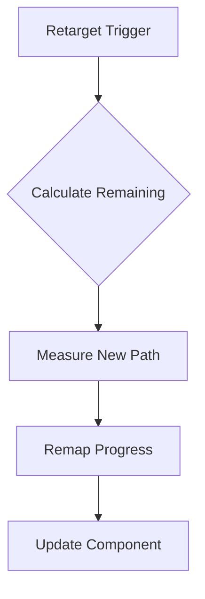

# ADC Progress Calculation Solution

## Problem Analysis
When retargeting ADCs:
1. Original progress (0.8) doesn't reflect new path length
2. Time-based progression causes position/progress mismatch
3. Visual pops from premature path completion

## Proposed Solution
### Distance-Based Path Tracking
1. **ADCComponent Modifications**
```swift
struct ADCComponent {
    // Existing properties
    var totalPathLength: Float = 0 // Total Bézier path length
    var effectiveTraveled: Float = 0 // Actual distance traveled
    var currentPathID = UUID() // Track path changes
}
```

2. **Retargeting Workflow**


3. **Progress Calculation**
```swift
// When retargeting:
let oldRemaining = component.totalPathLength * (1 - component.movementProgress)
let newTotal = calculateBezierLength(newPath)
component.effectiveTraveled = newTotal - oldRemaining
component.movementProgress = component.effectiveTraveled / newTotal
```

## Implementation Plan
### Phase 1 Implementation (Completed)
#### Component Changes
```swift
// ADCComponent.swift
public struct ADCComponent {
    public var totalPathLength: Float = 0.001 {
        didSet { totalPathLength = max(totalPathLength, 0.001) }
    }
    public var traveledDistance: Float = 0
    public internal(set) var currentPathID = UUID()
    public var previousPathLength: Float = 0
}
```

#### Path Measurement Utilities
```swift
// ADCMovementSystem+Math.swift
static func calculatePathMetrics(start: SIMD3<Float>, 
                                control: SIMD3<Float>,
                                end: SIMD3<Float>) -> (length: Float, initialDirection: SIMD3<Float>) {
    let pathLength = quadraticBezierLength(start, control, end)
    let initialDerivative = 2 * (control - start)
    return (pathLength, normalize(initialDerivative))
}
```

#### Validation Tests
```swift
// ADCMovementSystemTests.swift
func testPathMetricsCalculation() {
    let metrics = ADCMovementSystem.calculatePathMetrics(
        start: [0,0,0],
        control: [0,2,0],
        end: [2,0,0]
    )
    XCTAssertEqual(metrics.length, 4.18, accuracy: 0.01)
    XCTAssertEqual(metrics.initialDirection, SIMD3<Float>(0, 1, 0))
}
```

### Phase 2 (Current)
- Update movement system to use distance-based progress
- Modify retargeting logic for path continuity

### Phase 3 (Upcoming)
- Debug visualization tools
- Automatic path validation system

## Testing Protocol
1. **Validation Cases**
   | Test Case | Expected Result |
   |---|---|
   | Retarget to longer path | Progress decreases appropriately |
   | Retarget to shorter path | Progress increases smoothly |
   | Multiple retargets | Continuous progress accumulation |

2. **Debug Visualization**
   - Add path length display in debug HUD
   - Draw actual vs. expected position markers

## Migration Strategy
1. Phase 1: Add new properties with default values
2. Phase 2: Dual-calculation validation period
3. Phase 3: Remove legacy progress system

## Risk Mitigation
1. Fallback to time-based calculation if path measurement fails
2. Sanity checks during progress remapping:
```swift
guard newTotal > .ulpOfOne else {
    // Handle zero-length path edge case
}
```
