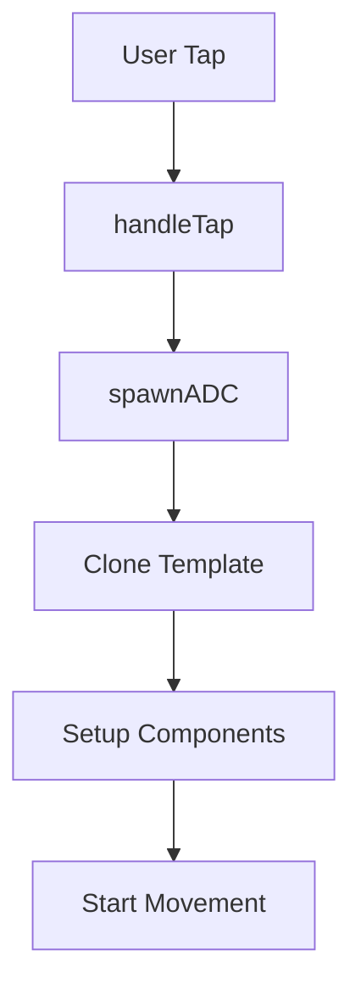

# ADC System Architecture

## Overview
This document outlines the ADC (Antibody-Drug Conjugate) system architecture, including spawning, movement, targeting, and collision handling.

## Core Components

### ADCComponent
```swift
public struct ADCComponent: Component {
    public enum State {
        case idle
        case moving
        case attached
    }
    
    var state: State = .idle
    var startWorldPosition: SIMD3<Float>?
    var movementProgress: Float = 0
    var targetEntityID: EntityID?
    var targetCellID: Int?
    var proteinSpinSpeed: Float
    var speedFactor: Float?
    var arcHeightFactor: Float?
}
```

### Key Systems
1. **AttackCancerViewModel**
   - Manages ADC template and spawning
   - Handles user interaction and targeting
   - Coordinates with movement system

2. **ADCMovementSystem**
   - Controls ADC movement along curved paths
   - Handles targeting and retargeting
   - Manages collision responses
   - Controls audio and visual feedback

## Spawning and Initialization

### User Interaction (`AttackCancerViewModel+HandInteraction.swift`)
1. Entry point: `handleTap(on:location:in:)`
   - Determines which hand initiated the tap using pinch distances
   - Gets hand position for spawn location
   - Validates cancer cell components and ID
   - Checks for available attachment point via `AttachmentSystem.getAvailablePoint`

### ADC Creation (`AttackCancerViewModel+ADC.swift`)
1. Template Setup (`setADCTemplate`):
   - Configures antibody colors using ShaderGraphMaterial
   - Sets up 4 linker colors with both PBR and ShaderGraph materials
   - Configures 4 sets of payload colors (inner/outer spheres)
   - Stores template for reuse

2. Spawning Process (`spawnADC`):
   - Parameters: position, targetPoint, cellID
   - Clones template with all color configurations
   - Sets up collision sphere (radius: 0.069)
   - Configures ADC component with:
     - Target cell ID
     - Start position
     - Random protein spin speed (8.0...10.0)
   - Adds to root entity
   - Initiates movement

## Movement System (`ADCMovementSystem.swift`)

### Core Parameters
```swift
static let numSteps: Double = 120
static let baseArcHeight: Float = 1.2
static let arcHeightRange: ClosedRange<Float> = 0.6...1.2
static let baseStepDuration: TimeInterval = 0.016  // 60fps
static let speedRange: ClosedRange<Float> = 1.2...3.0
static let minDistance: Float = 0.5
static let maxDistance: Float = 3.0

// Rotation Control
static let rotationSmoothingFactor: Float = 12.0
static let maxBankAngle: Float = .pi / 8
static let bankingSmoothingFactor: Float = 6.0

// Movement Phases
static let accelerationPhase: Float = 0.2
static let decelerationPhase: Float = 0.2
static let minSpeedMultiplier: Float = 0.4
```

### Movement Implementation
1. Path Calculation:
   - Uses quadratic Bezier curve
   - Dynamic height based on distance
   - Smooth acceleration/deceleration

2. Orientation Control (`ADCMovementSystem+Math.swift`):
   - Base orientation from movement direction
   - Protein spin in world space
   - Banking during turns
   - Quaternion validation

3. Target Management (`ADCMovementSystem+Retargeting.swift`):
   - Validates current target
   - Finds new targets based on:
     - Distance from current position
     - Attachment point availability
     - Cell state (not destroyed)
   - Handles smooth transitions

4. State Management (`ADCMovementSystem+Utils.swift`):
   - Handles reset conditions
   - Manages audio states
   - Cleans up animations

## Collision System (`AttackCancerViewModel+Collisions.swift`)

### Setup
1. Collision Groups:
   - ADC: mask against cancer cells
   - Cancer Cells: mask against ADCs
   - Blood Vessel Walls: specific collision handling

### Collision Handling
1. Impact Processing:
   - Uses CancerCellDamageComponent
   - Scales damage based on collision impulse (0.0001 multiplier)
   - Accumulates damage until threshold
   - Updates hit count when threshold reached

2. Physics Response:
   - High damping (0.9) for quick stabilization
   - Applies to both linear and angular motion
   - Configurable through physicsEnabled flag

3. State Management:
   - Tracks hit counts
   - Manages cell destruction
   - Handles ADC removal
   - Debounces collisions (threshold: 0.1s)

## Cancer Cell System (`CancerCellComponent.swift`)

### Parameters
```swift
public static let minRequiredHits = 4
public static let maxRequiredHits = 8
public static let tutorialImpactScale: Float = 0.1
```

### Components
1. CancerCellParameters:
   - Tracks state (hits, destruction)
   - Manages scaling animations
   - Controls physics behavior
   - Impact scale: 0.001 (reduced for minimal force)

2. CancerCellDamageComponent:
   - Damage threshold: 5.0
   - Decay rate: 0.5 per second
   - Accumulates impact damage

## Current Flow

### 1. ADC Spawning


- Triggered by `handleTap` in AttackCancerViewModel
- Requires target cell and position
- Clones from template with color configuration
- Sets up collision and ADC components
- Initiates movement via ADCMovementSystem

### 2. Movement System
Key parameters:
- Base arc height: 1.2
- Speed range: 1.2...3.0
- Steps: 120 for smooth motion
- Acceleration/deceleration phases: 20% each

Movement features:
- Quadratic Bezier curve path
- Variable speed and arc height
- Protein spin animation
- Banking and orientation control

### 3. Targeting System
Current targeting requirements:
- Must have line of sight to cancer cell
- Cell must not be destroyed
- Attachment point must be available

Retargeting capabilities:
- Can find new targets if current is invalid
- Uses distance-based selection
- Validates target state and availability

### 4. Collision Handling
Sequence:
1. Detect ADC-cell collision
2. Update hit count
3. Apply physics impact
4. Handle attachment
5. Trigger visual/audio effects

## Proposed Changes for Non-Targeted Firing

### Challenges to Address
1. Initial movement without target
2. Smooth transition from seeking to targeted movement
3. Maintaining existing collision and physics behavior
4. Audio/visual feedback during seeking state

### Impact Analysis
1. **AttackCancerViewModel**
   - Modify spawn logic to work without target
   - Add seeking state handling
   - Update user interaction flow

2. **ADCMovementSystem**
   - Add seeking behavior
   - Integrate with existing curved path movement
   - Handle smooth transitions

3. **Collision System**
   - No major changes needed
   - Existing physics still applies

4. **Performance Considerations**
   - Additional target searching overhead
   - Potential for multiple seeking ADCs

## Questions to Resolve
1. How often should seeking ADCs search for targets?
2. What should be the maximum seeking duration?
3. Should seeking ADCs have different physics/collision behavior?
4. How to handle multiple seeking ADCs targeting the same cell?

## Next Steps
1. [ ] Implement ADCComponent seeking state
2. [ ] Modify spawn logic for targetless creation
3. [ ] Add seeking behavior to movement system
4. [ ] Test and validate changes
5. [ ] Update documentation 