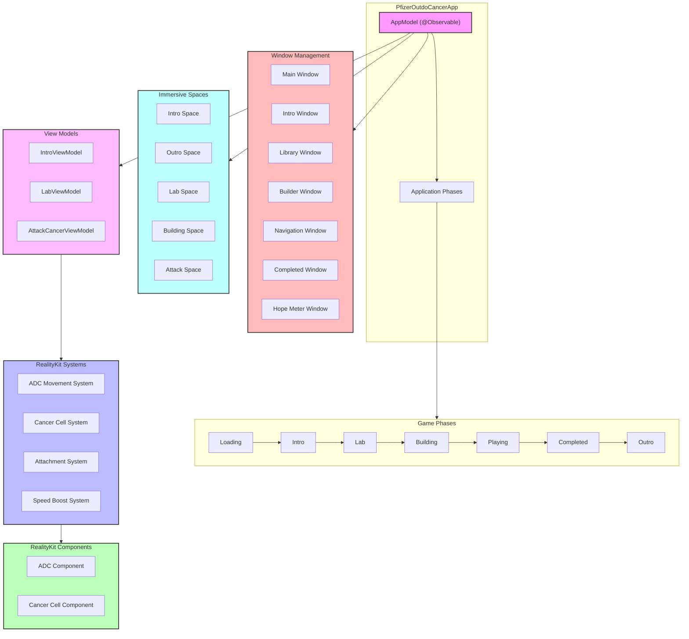

# Pfizer Outdo Cancer App Architecture

## Application Flow and Components

## Key Features

1. **State Management**
   - Uses `@Observable` for reactive state management
   - Centralized `AppModel` for app-wide state
   - Phase-based navigation system

2. **Window Management**
   - Multiple windows for different app sections
   - Utility windows for game mechanics
   - Navigation window for debug/development

3. **Immersive Spaces**
   - Dedicated spaces for different game phases
   - Smooth transitions between spaces
   - Asset management per space

4. **RealityKit Integration**
   - Entity Component System (ECS) architecture
   - Custom components for game objects
   - Specialized systems for movement and interactions

5. **UI/UX**
   - SwiftUI for 2D interfaces
   - RealityKit for 3D content
   - Smooth animations and transitions
   - Glass background effects

6. **Asset Management**
   - Dynamic asset loading/unloading
   - Phase-specific resource management
   - Memory optimization

## Architecture Notes

- The app follows a phase-based architecture where each phase (Intro, Lab, Building, etc.) has its own immersive space and UI components
- State management is handled through the `@Observable` AppModel
- RealityKit's ECS is used for 3D content and game mechanics
- Windows and views are managed through SwiftUI
- Asset loading is optimized per phase to manage memory usage
